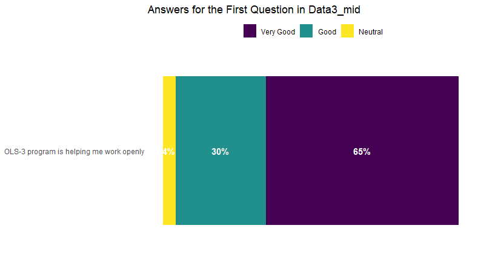
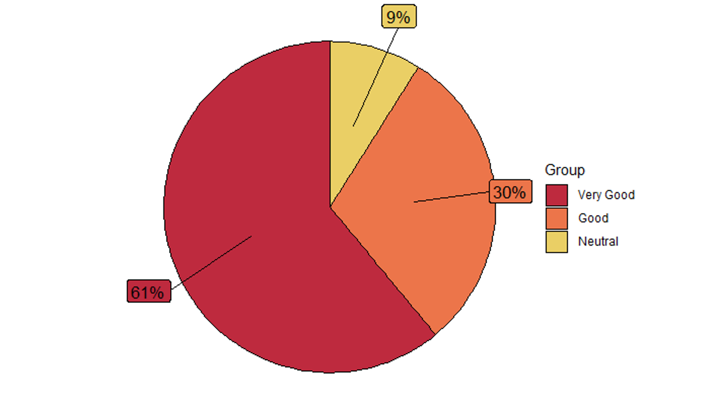

Folder includes only multiple choice questions which are 1,2,4,5,6,7,8,9,11,12.

**Question 1:** OLS-3 program is helping me working openly

 

**Question 2:** OLS-3 is helping me encourage others to work openly

 

**Question 4:** Which of the following aspects of the cohort call work well?

 

